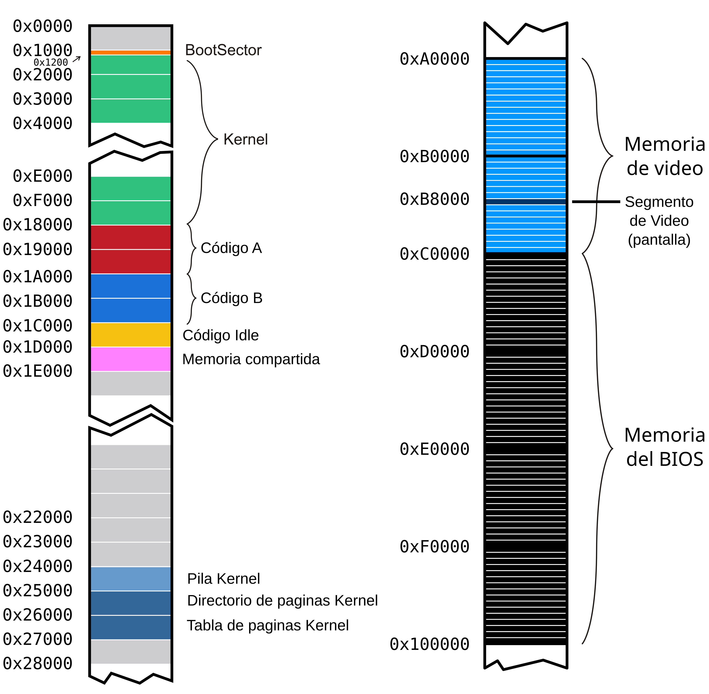
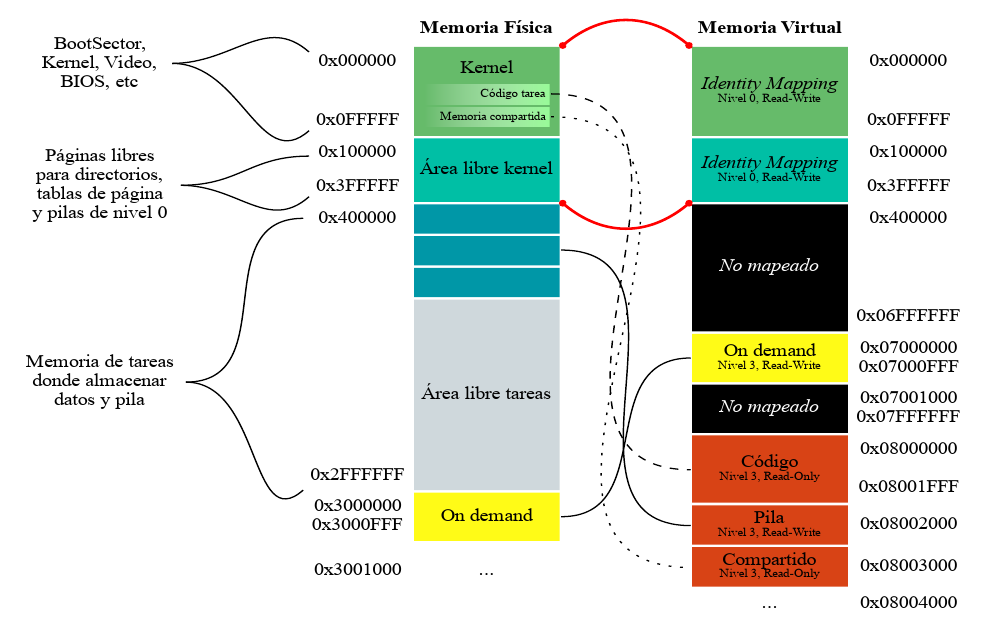

# System Programming: Tareas.

Vamos a continuar trabajando con el kernel que estuvimos programando en
los talleres anteriores. La idea es incorporar la posibilidad de
ejecutar algunas tareas específicas. Para esto vamos a precisar:

-   Definir las estructuras de las tareas disponibles para ser
    ejecutadas

-   Tener un scheduler que determine la tarea a la que le toca
    ejecutase en un período de tiempo, y el mecanismo para el
    intercambio de tareas de la CPU

-   Iniciar el kernel con una *tarea inicial* y tener una *tarea idle*
    para cuando no haya tareas en ejecución

Recordamos el mapeo de memoria con el que venimos trabajando. Las tareas
que vamos a crear en este taller van a ser parte de esta organización de
la memoria:





## Archivos provistos

A continuación les pasamos la lista de archivos que forman parte del
taller de hoy junto con su descripción:

-   **Makefile** - encargado de compilar y generar la imagen del
    floppy disk.

-   **idle.asm** - código de la tarea Idle.

-   **shared.h** -- estructura de la página de memoria compartida

-   **tareas/syscall.h** - interfaz para realizar llamadas al sistema
    desde las tareas

-   **tareas/task_lib.h** - Biblioteca con funciones útiles para las
    tareas

-   **tareas/task_prelude.asm**- Código de inicialización para las
    tareas

-   **tareas/taskPong.c** -- código de la tarea que usaremos
    (**tareas/taskGameOfLife.c, tareas/taskSnake.c,
    tareas/taskTipear.c **- código de otras tareas de ejemplo)

-   **tareas/taskPongScoreboard.c** -- código de la tarea que deberán
    completar

-   **tss.h, tss.c** - definición de estructuras y funciones para el
    manejo de las TSSs

-   **sched.h, sched.c** - scheduler del kernel

-   **tasks.h, tasks.c** - Definición de estructuras y funciones para
    la administración de tareas

-   **isr.asm** - Handlers de excepciones y interrupciones (en este
    caso se proveen las rutinas de atención de interrupciones)

-   **task\_defines.h** - Definiciones generales referente a tareas

## Ejercicios

### Primera parte: Inicialización de tareas

**1.** Si queremos definir un sistema que utilice sólo dos tareas, ¿Qué
nuevas estructuras, cantidad de nuevas entradas en las estructuras ya
definidas, y registros tenemos que configurar?¿Qué formato tienen?
¿Dónde se encuentran almacenadas?

> Necesitamos una **Estructura de Tarea (TSS)** y un **Descriptor de TSS**.  
  
Cada tarea necesita un TSS para almacenar su contexto de CPU cuando no está en ejecución. En este caso, se requieren dos TSS, uno para cada tarea. Ademas, agregamos dos nuevas entradas para apuntar a los TSS de las dos tareas.  
Luego, necesitamos configurar los registros CR3, ESP0, EIP, EFLAGS, ESP y registros generales (EAX, EBX, ECX, etc.).  
Finalmente, Los TSS se almacenan en la memoria física, y sus descriptores en la GDT

**2.** ¿A qué llamamos cambio de contexto? ¿Cuándo se produce? ¿Qué efecto
tiene sobre los registros del procesador? Expliquen en sus palabras que
almacena el registro **TR** y cómo obtiene la información necesaria para
ejecutar una tarea después de un cambio de contexto.

> Un **cambio de contexto** es el proceso de guardar el estado de una tarea en ejecución (los valores de sus registros y contexto) y cargar el estado de la siguiente tarea que se va a ejecutar.  Se produce cuando el scheduler decide cambiar de tarea, ya sea por tiempo de ejecución agotado, interrupciones, o una condición específica.  
  
> Tiene el efecto de **guardar** todos los registros de la CPU (registros generales, de segmento, e IP) de la tarea actual en su TSS o pila y luego **restaurar** los registros de la nueva tarea, permitiendo que la nueva tarea retome su ejecución exactamente donde fue pausada.  
  
> El **registro TR (Task Register)** almacena un selector de segmento que apunta al TSS de la tarea actualmente activa; es el registro que permite a la CPU acceder directamente al TSS de la tarea en ejecución.  Obtiene la informacion necesaria gracias a que el **selector en TR** apunta al TSS de la nueva tarea, la CPU accede al TSS a través de TR para cargar el contexto de la tarea, donde esto permite que la nueva tarea continúe su ejecución desde donde fue pausada.

**3.** Al momento de realizar un cambio de contexto el procesador va
almacenar el estado actual de acuerdo al selector indicado en el
registro **TR** y ha de restaurar aquel almacenado en la TSS cuyo
selector se asigna en el *jmp* far. ¿Qué consideraciones deberíamos
tener para poder realizar el primer cambio de contexto? ¿Y cuáles cuando
no tenemos tareas que ejecutar o se encuentran todas suspendidas?

> **Para realizar el primer cambio de contexto**:  
    Hay que cargar el registro TR con el selector de TSS de la primer tarea usando la instrucción ltr (Load Task Register);  
    el TSS de la primer tarea debe estar correctamente configurado, incluyendo valores válidos para CR3 (tabla de páginas), EIP (instrucción de inicio), ESP0 (pila de nivel 0);  
    y, finalmente, usar un salto jmp far hacia el selector del TSS de la tarea a ejecutar, para que el procesador cambie el contexto de manera automática.  

> **Cuando no tenemos tareas que ejecutar o se encuentran todas suspendidas**:  
    Habria que definir una tarea idle que actúe como un "relleno" cuando no haya otras tareas listas para ejecutar, que debería estar configurada en la GDT con un TSS y un código que mantenga el sistema en un bucle de bajo consumo o esperando una interrupción;  
    ademas, el scheduler debe tener lógica para detectar cuándo todas las tareas están suspendidas o en espera para seleccionar la tarea idle y evitar que el sistema se quede sin ejecutar nada;  


**4.** ¿Qué hace el scheduler de un Sistema Operativo? ¿A qué nos
referimos con que usa una política?
> El **scheduler** gestiona el tiempo de ejecución de las tareas o procesos y decide cuál de ellos debe ejecutarse en cada momento. Su principal función es cambiar de contexto entre tareas para maximizar la eficiencia y cumplir con los objetivos del sistema.  
  
> Con que **usa una política**, nos referimos a que sigue un conjunto de reglas o criterios para decidir el orden y duración con que cada tarea es ejecutada; define cómo y cuándo se selecciona cada tarea, y puede variar según los objetivos del sistema operativo. Ejemplos: Round Robin, Prioridades, o Multinivel.

**5.** En un sistema de una única CPU, ¿cómo se hace para que los
programas parezcan ejecutarse en simultáneo?
> Se hace mediante un proceso llamado **multitasking con cambio de contexto**, donde la CPU ejecuta una tarea por un breve intervalo de tiempo. Luego, realiza un cambio de contexto para ejecutar otra tarea, y así sucesivamente; pero este proceso ocurre tan rápido que da la ilusión de que múltiples programas están ejecutándose al mismo tiempo.

**6.** En **tss.c** se encuentran definidas las TSSs de la Tarea
**Inicial** e **Idle**. Ahora, vamos a agregar el *TSS Descriptor*
correspondiente a estas tareas en la **GDT**.
    
a) Observen qué hace el método: ***tss_gdt_entry_for_task***
> **Hecho**

b) Escriban el código del método ***tss_init*** de **tss.c** que
agrega dos nuevas entradas a la **GDT** correspondientes al
descriptor de TSS de la tarea Inicial e Idle.
> **Hecho (ver tss.c)**

c) En **kernel.asm**, luego de habilitar paginación, agreguen una
llamada a **tss_init** para que efectivamente estas entradas se
agreguen a la **GDT**.
> **Hecho (ver kernel.asm)**

d) Correr el *qemu* y usar **info gdt** para verificar que los
***descriptores de tss*** de la tarea Inicial e Idle esten
efectivamente cargadas en la GDT
> **Hecho**

**7.** Como vimos, la primer tarea que va a ejecutar el procesador
cuando arranque va a ser la **tarea Inicial**. Se encuentra definida en
**tss.c** y tiene todos sus campos en 0. Antes de que comience a ciclar
infinitamente, completen lo necesario en **kernel.asm** para que cargue
la tarea inicial. Recuerden que la primera vez tenemos que cargar el registro
**TR** (Task Register) con la instrucción **LTR**.
Previamente llamar a la función tasks_screen_draw provista para preparar
la pantalla para nuestras tareas.

Si obtienen un error, asegurense de haber proporcionado un selector de
segmento para la tarea inicial. Un selector de segmento no es sólo el
indice en la GDT sino que tiene algunos bits con privilegios y el *table
indicator*.
> **Hecho (ver kernel.asm)**

**8.** Una vez que el procesador comenzó su ejecución en la **tarea Inicial**, 
le vamos a pedir que salte a la **tarea Idle** con un
***JMP***. Para eso, completar en **kernel.asm** el código necesario
para saltar intercambiando **TSS**, entre la tarea inicial y la tarea
Idle.
> **Hecho (ver kernel.asm)**

**9.** Utilizando **info tss**, verifiquen el valor del **TR**.
También, verifiquen los valores de los registros **CR3** con **creg** y de los registros de segmento **CS,** **DS**, **SS** con ***sreg***. 
¿Por qué hace falta tener definida la pila de nivel 0 en la tss?

> Ante el cambio de nivel de privilegio se hace, también, un cambio en el uso de la pila y como cada tarea tiene su propia pila de nivel 0 es requerido de preservarla en alguna estructura como la tss.

**10.** En **tss.c**, completar la función ***tss_create_user_task***
para que inicialice una TSS con los datos correspondientes a una tarea
cualquiera. La función recibe por parámetro la dirección del código de
una tarea y será utilizada más adelante para crear tareas.
> **Hecho (ver tss.c)**

Las direcciones físicas del código de las tareas se encuentran en
**defines.h** bajo los nombres ***TASK_A_CODE_START*** y
***TASK_B_CODE_START***.

El esquema de paginación a utilizar es el que hicimos durante la clase
anterior. Tener en cuenta que cada tarea utilizará una pila distinta de
nivel 0.

### Segunda parte: Poniendo todo en marcha

**11.** Estando definidas **sched_task_offset** y **sched_task_selector**:
```
  sched_task_offset: dd 0xFFFFFFFF
  sched_task_selector: dw 0xFFFF
```

Y siendo la siguiente una implementación de una interrupción del reloj:

```
global _isr32
  
_isr32:
  pushad
  call pic_finish1
  
  call sched_next_task
  
  str cx
  cmp ax, cx
  je .fin
  
  mov word [sched_task_selector], ax
  jmp far [sched_task_offset]
  
  .fin:
  popad
  iret
```
a)  Expliquen con sus palabras que se estaría ejecutando en cada tic
    del reloj línea por línea
> **pushad** guarda el estado de todos los registros generales en la pila para conservar el contexto actual antes de cualquier modificación;  
   **call pic_finish1** llama a una función indicando que la interrupción de reloj fue atendida;  
   **call sched_next_task** llama a una función del scheduler que selecciona la próxima tarea a ejecutar y configura el registro AX con el selector de TSS de esa tarea;  
   **str cx** carga el selector de la tarea actual en el registro CX usando el registro TR, permitiendo comparar el selector de la tarea actual con la próxima tarea;  
   **cmp ax, cx** compara el selector de la tarea actual con el selector de la próxima tarea para verificar si la próxima tarea es la misma que la actual;  
   **je .fin** salta a la etiqueta .fin si los selectores coinciden (evita un cambio de contexto innecesario);  
   **mov word [sched_task_selector], ax** guarda el nuevo selector de tarea en sched_task_selector para actualizar la información de la próxima tarea (si la tarea es diferente a la actual);  
   **jmp far [sched_task_offset]** hace un salto hacia sched_task_offset, que contiene la dirección completa (offset y selector) de la nueva tarea, lo que permite el cambio de contexto hacia la nueva tarea;  
   **popad** restaura el estado de todos los registros generales desde la pila;  
   **iret** finaliza la interrupción

b)  En la línea que dice ***jmp far \[sched_task_offset\]*** ¿De que
    tamaño es el dato que estaría leyendo desde la memoria? ¿Qué
    indica cada uno de estos valores? ¿Tiene algún efecto el offset
    elegido?
> El tamaño del dato que lee es de 6 bytes. El jmp far usa 4 bytes para el offset y 2 bytes para el selector de segmento.  
  
> El **offset** (4 bytes) representa la dirección de inicio de la instrucción en la nueva tarea, tal que apunta a la posición exacta en la memoria desde donde continuará la ejecución.  
   El **selector** (2 bytes) indica el segmento de memoria (en este caso, el TSS) que contiene el contexto de la tarea.  
  
> No tiene efecto debido a que al leer el selector de segmento y verificar que es una TSS, carga la TSS y continua la ejecución en base al nuevo contexto cargado.

c)  ¿A dónde regresa la ejecución (***eip***) de una tarea cuando
    vuelve a ser puesta en ejecución?
> **EIP** se restaura desde el TSS asociado a esa tarea, apuntando a la instrucción donde la tarea fue interrumpida previamente, asegurando que la tarea continúe su ejecución exactamente en el punto donde fue suspendida, sin perder su contexto


**12.** Para este Taller la cátedra ha creado un scheduler que devuelve
la próxima tarea a ejecutar.

a)  En los archivos **sched.c** y **sched.h** se encuentran definidos
    los métodos necesarios para el Scheduler. Expliquen cómo funciona
    el mismo, es decir, cómo decide cuál es la próxima tarea a
    ejecutar. Pueden encontrarlo en la función ***sched_next_task***.

> **sched_next_task** recorre las tareas en orden secuencial (política de planificación Round-Robin), buscando la próxima tarea que esté en un estado ejecutable (TASK_RUNNABLE). Si no encuentra ninguna, selecciona una tarea idle como último recurso.

b)  Modifiquen **kernel.asm** para llamar a la función
    ***sched_init*** luego de iniciar la TSS
> **Hecho (ver kernel.asm)**

c)  Compilen, ejecuten ***qemu*** y vean que todo sigue funcionando
    correctamente.
> **Hecho**

### Tercera parte: Tareas? Qué es eso?

**14.** Como parte de la inicialización del kernel, en kernel.asm se
pide agregar una llamada a la función **tasks_init** de
**tasks.c** que a su vez llama a **create_task**. Observe las
siguientes líneas:
```C
int8_t task_id = sched_add_task(gdt_id << 3);

tss_tasks[task_id] = tss_create_user_task(task_code_start[tipo]);

gdt[gdt_id] = tss_gdt_entry_for_task(&tss_tasks[task_id]);
```
a)  ¿Qué está haciendo la función ***tss_gdt_entry_for_task***?
> **tss_gdt_entry_for_task** está creando una entrada en la GDT que apunta a la TSS de una tarea específica, permitiendo que el sistema pueda hacer cambios de contexto hacia esa tarea.

b)  ¿Por qué motivo se realiza el desplazamiento a izquierda de
    **gdt_id** al pasarlo como parámetro de ***sched_add_task***?
> El desplazamiento a izquierda por 3 bits de gdt_id se realiza para convertir el índice de la GDT en un selector de segmento.

**15.** Ejecuten las tareas en *qemu* y observen el código de estas
superficialmente.
> **Revisar**

a) ¿Qué mecanismos usan para comunicarse con el kernel?
> Se usan **interrupciones de hardware** (como el tick del reloj), **llamadas al sistema (syscalls)** para comunicar eventos y recibir actualizaciones de estado, y tambien **Memoria Compartida** (por ejemplo, para que las tareas sincronicen su estado con el kernel sin manipular directamente variables globales).

b) ¿Por qué creen que no hay uso de variables globales? ¿Qué pasaría si
    una tarea intentase escribir en su `.data` con nuestro sistema?

> Creemos que no hay uso de variables globales para garantizar que cada tarea mantenga su propio estado sin interferir con el de las demás, y así evitar conflictos.  
   Ademas, esto evita que se acceda a variables globales del kernel o de otras tareas, lo que podría causar inestabilidad o corrupción de datos.  

> Si una tarea intenta manipular la .data de otra tarea o del kernel, esto desencadenaría un **fallo de protección de memoria (page fault o segment fault)**.

c) Cambien el divisor del PIT para \"acelerar\" la ejecución de las tareas:
```
    ; El PIT (Programmable Interrupt Timer) corre a 1193182Hz.

    ; Cada iteracion del clock decrementa un contador interno, cuando
    éste llega

    ; a cero se emite la interrupción. El valor inicial es 0x0 que
    indica 65536,

    ; es decir 18.206 Hz

    mov ax, DIVISOR

    out 0x40, al

    rol ax, 8

    out 0x40, al
```
> **Hecho (kernel.asm)**

**16.** Observen **tareas/task_prelude.asm**. El código de este archivo
se ubica al principio de las tareas.

a. ¿Por qué la tarea termina en un loop infinito?
> Porque, al finalizar la ejecución de *task*, no hay ninguna instrucción definida para continuar el flujo de ejecución del programa. Entonces, se usa el jmp para evitar que el código intente acceder a direcciones no válidas o ejecute instrucciones no deseadas.

b. \[Opcional\] ¿Qué podríamos hacer para que esto no sea necesario?
> Podriamos:  
   **Implementar un scheduler para tareas múltiples** que permita cambiar entre tareas cuando una finaliza, tal que, al retornar de task, el sistema operativo podría restaurar el contexto de otra tarea en lugar de quedar en un bucle infinito;
   o **agregar una instrucción de hlt**, que detiene la CPU hasta la siguiente interrupción de hardware.

### Cuarta parte: Hacer nuestra propia tarea

Ahora programaremos nuestra tarea. La idea es disponer de una tarea que
imprima el *score* (puntaje) de todos los *Pongs* que se están
ejecutando. Para ello utilizaremos la memoria mapeada *on demand* del
taller anterior.

#### Análisis:

**18.** Analicen el *Makefile* provisto. ¿Por qué se definen 2 "tipos"
de tareas? ¿Como harían para ejecutar una tarea distinta? Cambien la
tarea *Snake* por una tarea *PongScoreboard*.

> Se definen 2 "tipos" debido a que uno es el ***Idle***, que sirve para asegurar que siempre haya algo en ejecución, previniendo que el CPU se quede sin tareas asignadas, mientras que el otro tipo es el de ***Tareas de usuario***, que son las tareas ejecutables que representan a las aplicaciones o procesos especificos requeridos por el usuario.  
  
> Para ejecutar una tarea distinta, se deberia usar un scheduler en el kernel, ya que puede programar tareas y usarlas cuando estén listas para ejecutarse, alternando entre ellas y la tarea Idle.  
Habria que cambiar el contexto actual a la tarea deseada, e interrumpir la tarea actual para realizar un salto al punto de entrada de la nueva tarea.

**19.** Mirando la tarea *Pong*, ¿En que posición de memoria escribe
esta tarea el puntaje que queremos imprimir? ¿Cómo funciona el mecanismo
propuesto para compartir datos entre tareas?

> Lo escribe en la dirección compartida definida en **SHARED_SCORE_BASE_VADDR**, que a la vez esta definido como **PAGE_ON_DEMAND_BASE_VADDR + 0xF00**  
  
> Funciona mediante la implementación de esta dirección de memoria compartida, que permite que múltiples tareas puedan acceder a la misma región de memoria.  
   Si una función quiere modificar algo, el sistema escribe directamente en esta página compartida para que otras tareas o funciones puedan leer estos valores sin interferencia y en tiempo real.

#### Programando:

**20.** Completen el código de la tarea *PongScoreboard* para que
imprima en la pantalla el puntaje de todas las instancias de *Pong* usando los datos que nos dejan en la página compartida.
> **Hecho (taskPongScoreboard.c)**

**21.** \[Opcional\] Resuman con su equipo todas las estructuras vistas
desde el Taller 1 al Taller 4. Escriban el funcionamiento general de
segmentos, interrupciones, paginación y tareas en los procesadores
Intel. ¿Cómo interactúan las estructuras? ¿Qué configuraciones son
fundamentales a realizar? ¿Cómo son los niveles de privilegio y acceso a
las estructuras?

**22.** \[Opcional\] ¿Qué pasa cuando una tarea dispara una
excepción? ¿Cómo podría mejorarse la respuesta del sistema ante estos
eventos?

> Cuando una tarea dispara una excepción, la CPU interrumpe la ejecución normal de la tarea o función y ejecuta una rutina especial de manejo de excepciones, definida por el sistema operativo.  La CPU salva el contexto actual de la tarea y transfiere el control a un manejador de excepciones, donde el manejador de excepciones identifica el tipo de excepción que ocurrió.
  
> Podria mejorarse utilizando, por ejemplo:  
> * Manejadores de excepciones específicos  
> * Recuperaciones automáticas del sistema  
> * Envio de notificaciones a la tarea para que se permita manejarlo  
> * Ejecutar tareas dentro de entornos controlados (sandboxes)  
> * Habilitar el reinicio de tareas críticas  
> * Realizar una detección temprana de la excepcion y ejecutar una depuración que permita arreglarlo


